# UJI 跨项目结果汇总 · 2026-09-30

本次汇总已有实验，不启动新训练。5张汇报表、8张图，表格/图表/解释文字分开保存。PNG为4000×2250；另附SVG/PDF，表格另附HTML/TSV。没有PPT文件。

[文字解释](03_文字说明/结果解读.md) · [全部25项分支登记](01_表格/T06_全部分支登记.md) · [36份来源与提交记录](04_数据与来源/来源与口径.md) · [图表数值TSV](04_数据与来源/图表数值.tsv)

## 方法成果的GitHub位置

- [GUFU式TPM更新：代码、推导与结果](https://github.com/Amanon-666/Femloc/tree/tpm-gufu-unlabeled/docs/research)，提交`fe0f559`。
- [学习型TPM核：代码、推导与结果](https://github.com/Amanon-666/Femloc/tree/tpm-learned-map/docs/research)，提交`34cd89d`。
- 两条分支原先只在本机保存/关联实验室远端，本次按用户要求推送GitHub。分支提交不等于原训练提交，训练版本见各报告。
- 对比的[uji-explore新分支](https://github.com/Amanon-666/uji-explore/tree/research/gconvloc-jprl-uegloc-20260930)没有改动。

## 表格

### TPM 主线：少量标注能换来多少精度？

[可复制表格](01_表格/T01_TPM主线.md) · [HTML](01_表格/T01_TPM主线.html) · [TSV](01_表格/T01_TPM主线.tsv) · [SVG](01_表格/T01_TPM主线.svg)

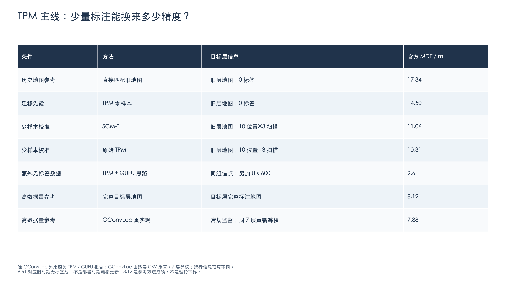

### 新增模块：只看各自协议内的成对变化

[可复制表格](01_表格/T02_可归因的增量.md) · [HTML](01_表格/T02_可归因的增量.html) · [TSV](01_表格/T02_可归因的增量.tsv) · [SVG](01_表格/T02_可归因的增量.svg)

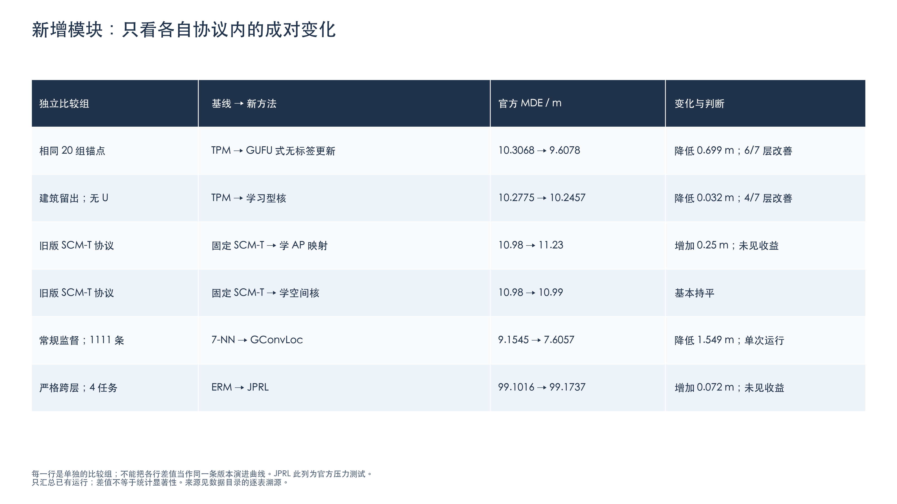

### 历史方法：三个目标层的结果与实验条件

[可复制表格](01_表格/T03_历史少样本主线.md) · [HTML](01_表格/T03_历史少样本主线.html) · [TSV](01_表格/T03_历史少样本主线.tsv) · [SVG](01_表格/T03_历史少样本主线.svg)

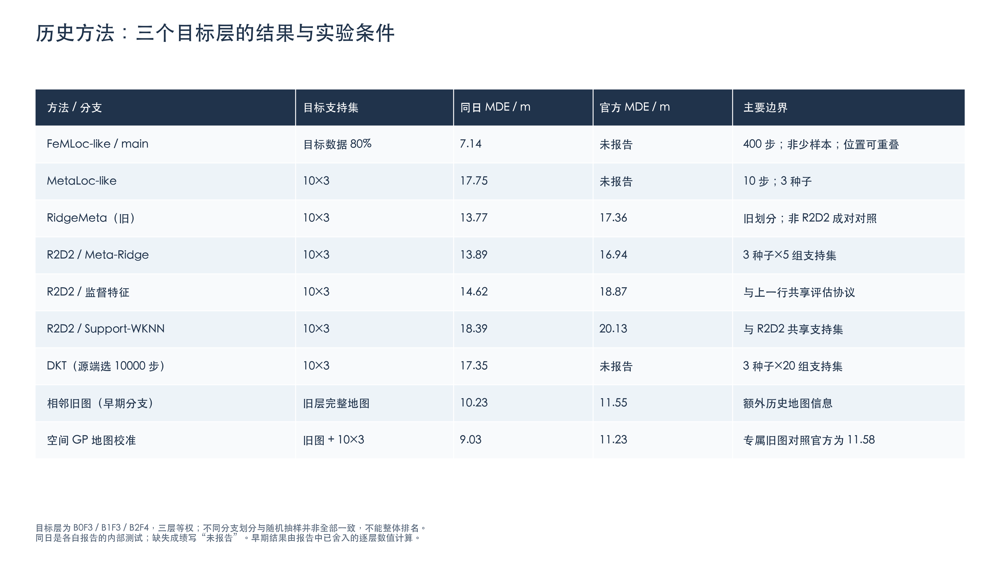

### 支持集训练变体：共享目标层与评估协议

[可复制表格](01_表格/T04_支持集训练变体.md) · [HTML](01_表格/T04_支持集训练变体.html) · [TSV](01_表格/T04_支持集训练变体.tsv) · [SVG](01_表格/T04_支持集训练变体.svg)

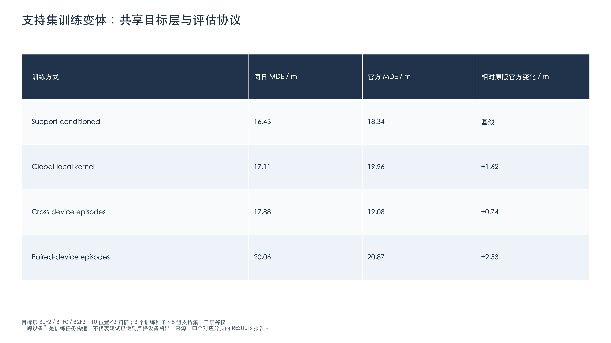

### uji-explore：新旧分支都保留，包括负结果

[可复制表格](01_表格/T05_uji_explore新旧分支.md) · [HTML](01_表格/T05_uji_explore新旧分支.html) · [TSV](01_表格/T05_uji_explore新旧分支.tsv) · [SVG](01_表格/T05_uji_explore新旧分支.svg)

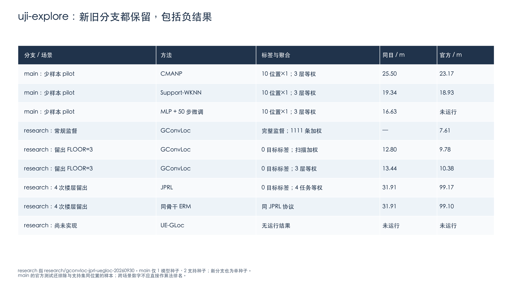

## 图表

### TPM 的主要优势出现在标注更少时

[PNG](02_图表/F01_锚点预算.png) · [SVG](02_图表/F01_锚点预算.svg) · [PDF](02_图表/F01_锚点预算.pdf)

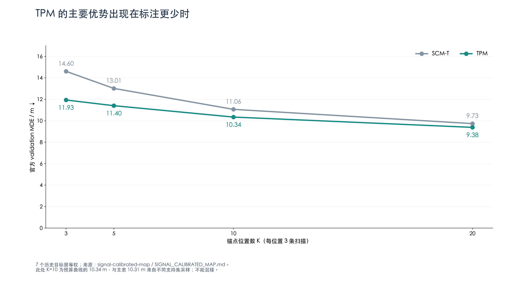

### 额外无标签扫描带来 0.70 m 改善，但并非每层都受益

[PNG](02_图表/F02_GUFU逐层变化.png) · [SVG](02_图表/F02_GUFU逐层变化.svg) · [PDF](02_图表/F02_GUFU逐层变化.pdf)

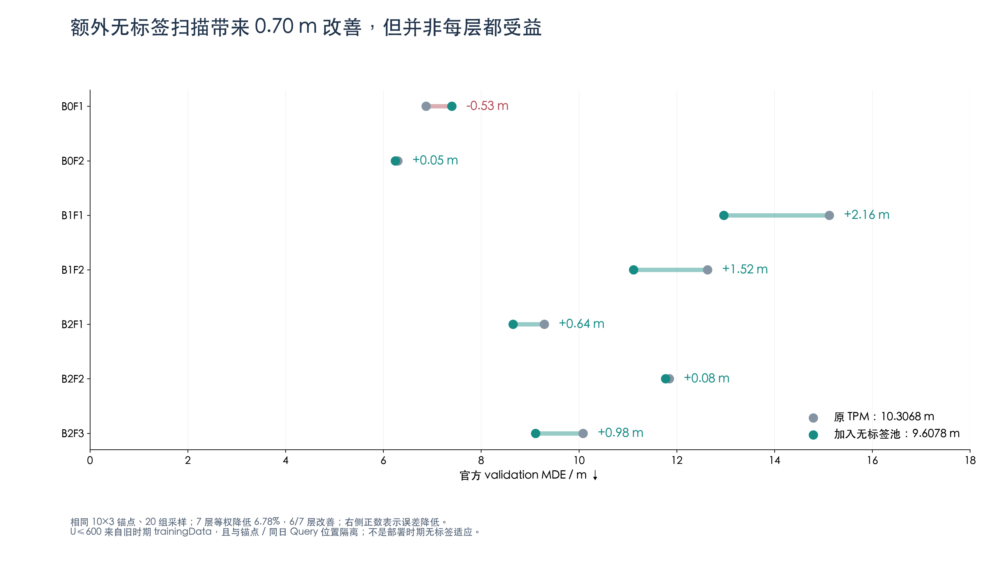

### 现有学习模块的增益很小：尚未证明值得替换固定先验

[PNG](02_图表/F03_学习模块增量.png) · [SVG](02_图表/F03_学习模块增量.svg) · [PDF](02_图表/F03_学习模块增量.pdf)

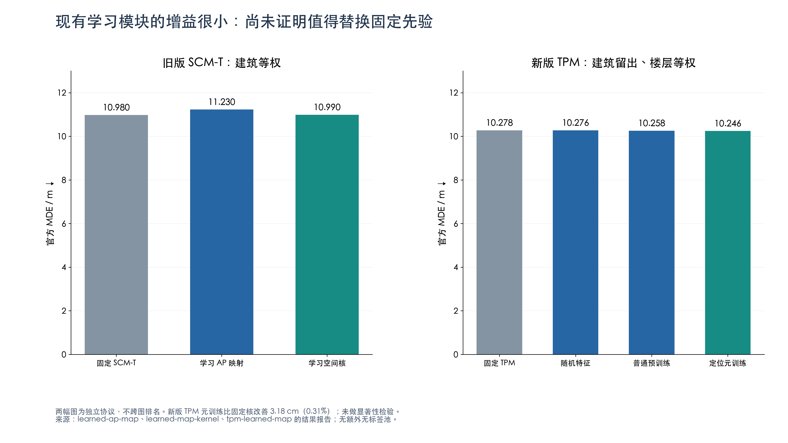

### R2D2：元训练特征在自己的少样本协议中有明确数值收益

[PNG](02_图表/F04_R2D2受控比较.png) · [SVG](02_图表/F04_R2D2受控比较.svg) · [PDF](02_图表/F04_R2D2受控比较.pdf)

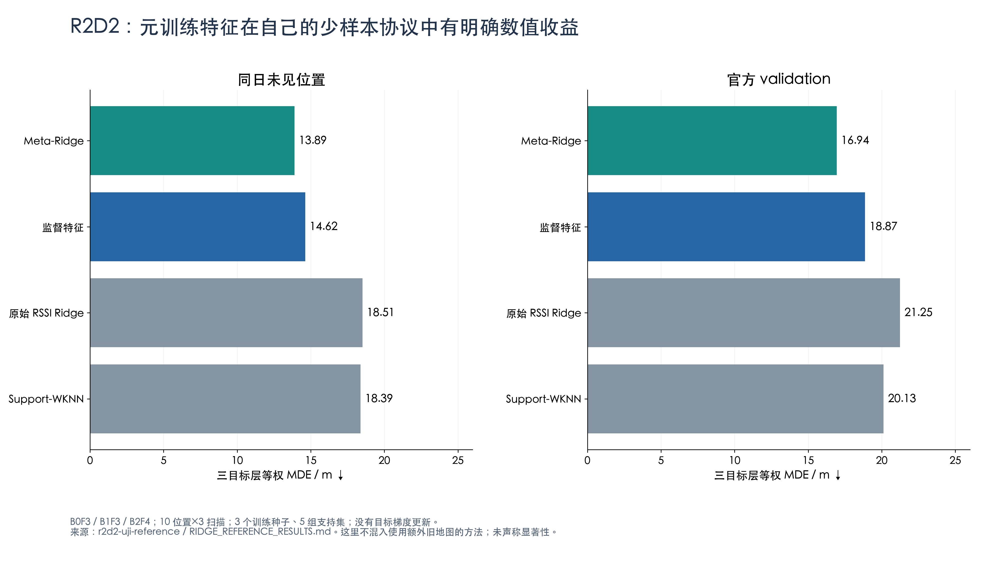

### GConvLoc 常规监督：平均误差更小，尾部误差也降低

[PNG](02_图表/F05_GConvLoc常规监督.png) · [SVG](02_图表/F05_GConvLoc常规监督.svg) · [PDF](02_图表/F05_GConvLoc常规监督.pdf)

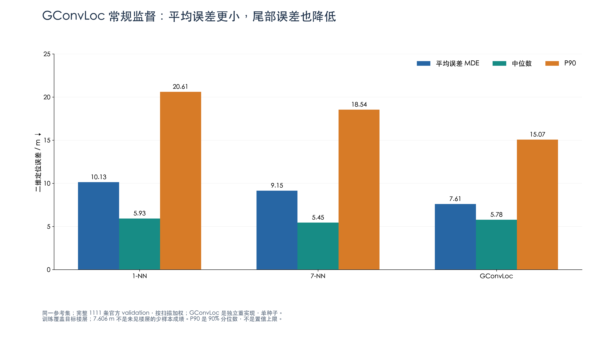

### 完全留出 FLOOR=3：GConvLoc 优于同参考集的近邻基线

[PNG](02_图表/F06_GConvLoc零样本跨层.png) · [SVG](02_图表/F06_GConvLoc零样本跨层.svg) · [PDF](02_图表/F06_GConvLoc零样本跨层.pdf)

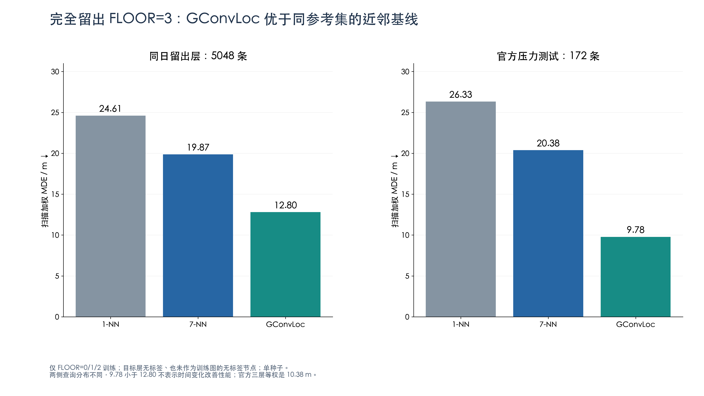

### JPRL 重实现：没有显示出相对同骨干 ERM 的收益

[PNG](02_图表/F07_JPRL负结果.png) · [SVG](02_图表/F07_JPRL负结果.svg) · [PDF](02_图表/F07_JPRL负结果.pdf)

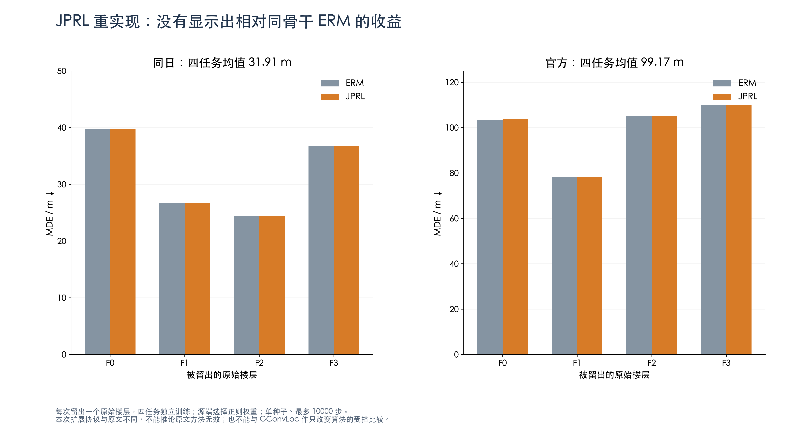

### 旧分支 CMANP pilot：增加支持样本尚未带来适应收益

[PNG](02_图表/F08_CMANP旧分支.png) · [SVG](02_图表/F08_CMANP旧分支.svg) · [PDF](02_图表/F08_CMANP旧分支.pdf)

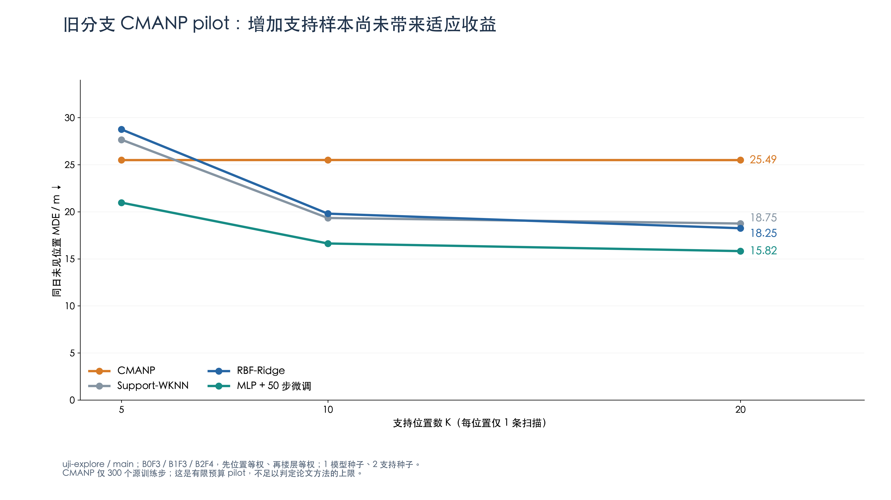

